# Praktikum Compute Service
## tugas 2
1. Membuat VM di EC2, dan Implementasi Security Group EC2
    - Create Instances
    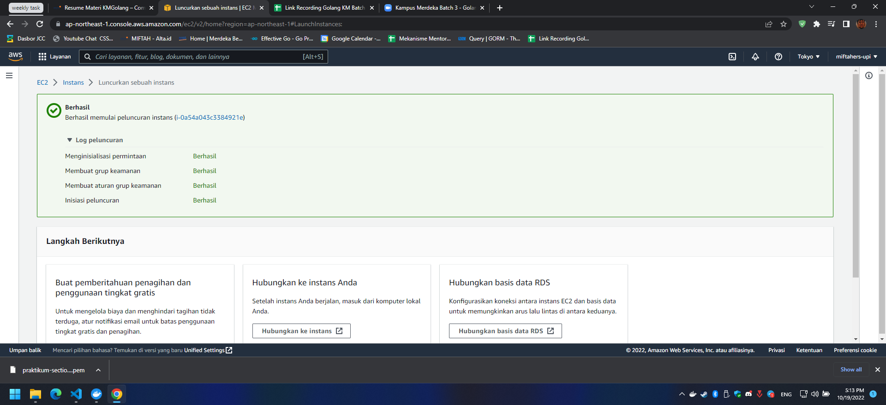
    - Set security Group
    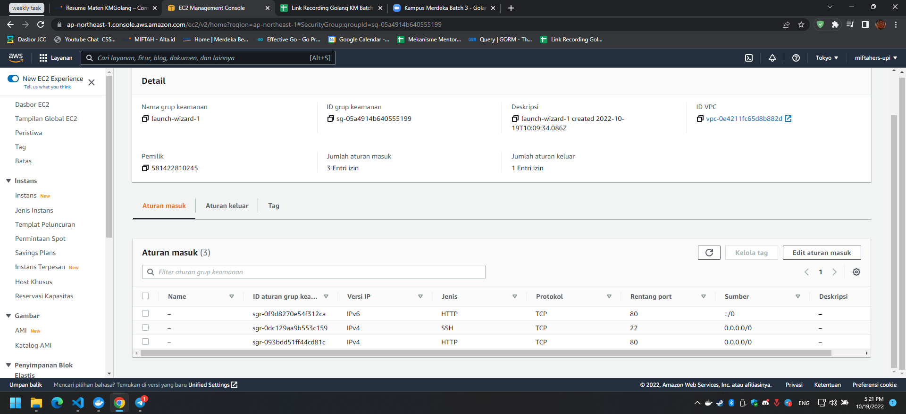

2. Melakukan ssh remote ke VM di AWS EC2 menggunakan key
   - aws configure & connect
    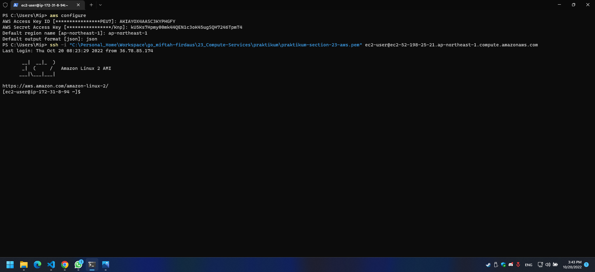
3. Deploy your program to EC2
   - Deploy program
    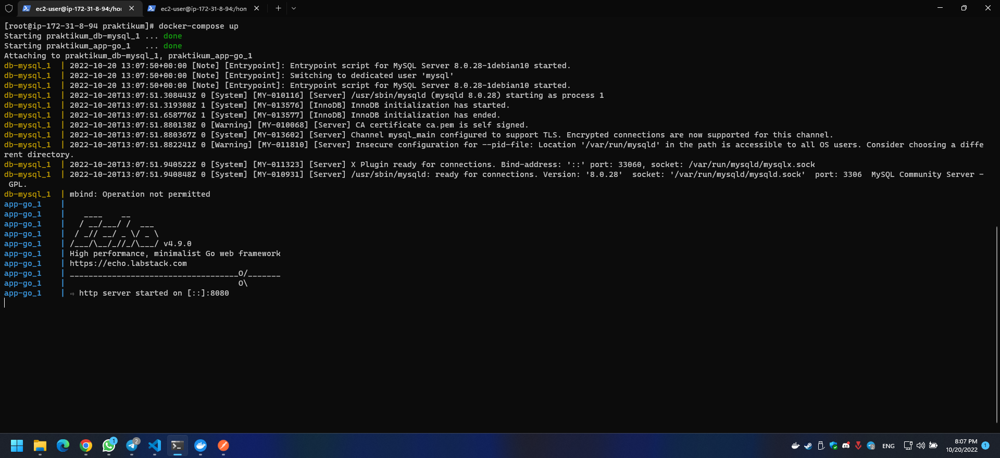
   - Test:
     - Create user
        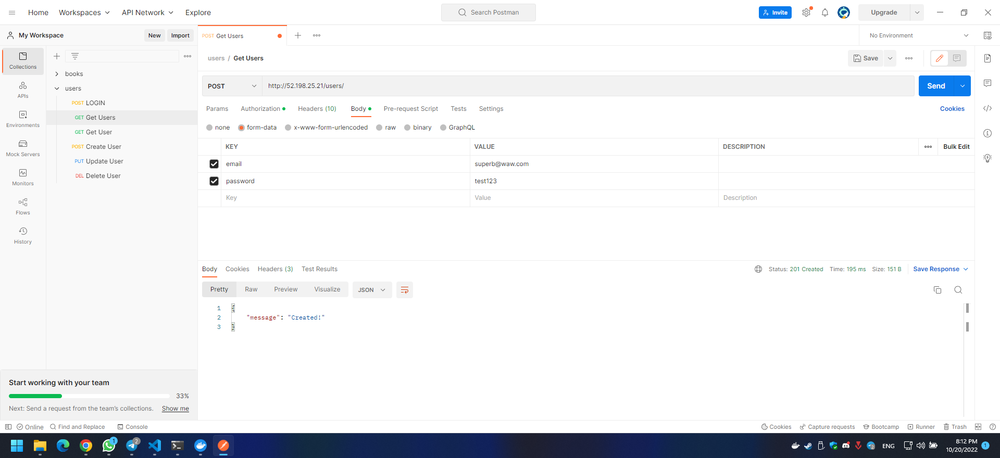
     - User login
        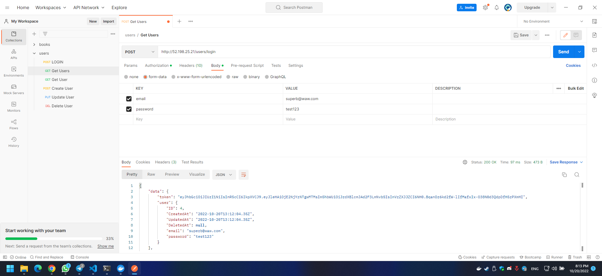
     - Get Users
        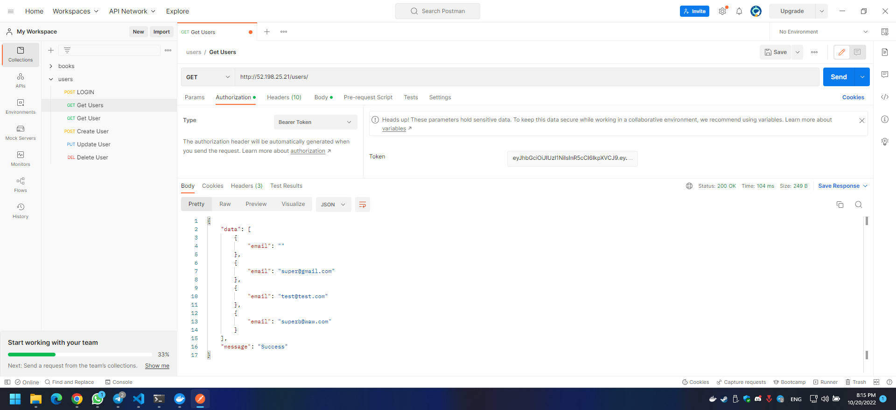

## tugas 3
1. Membuat DB di RDS
   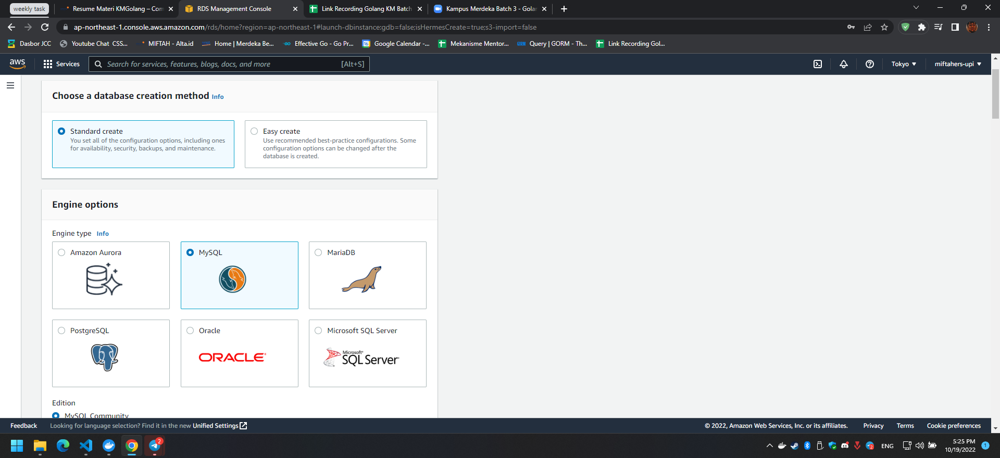
   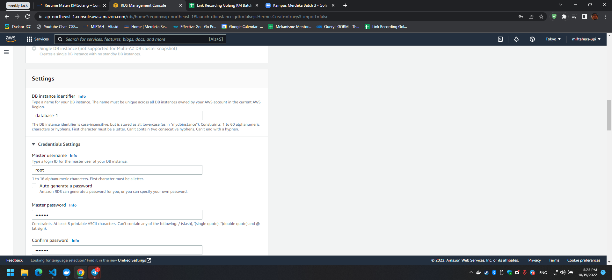
   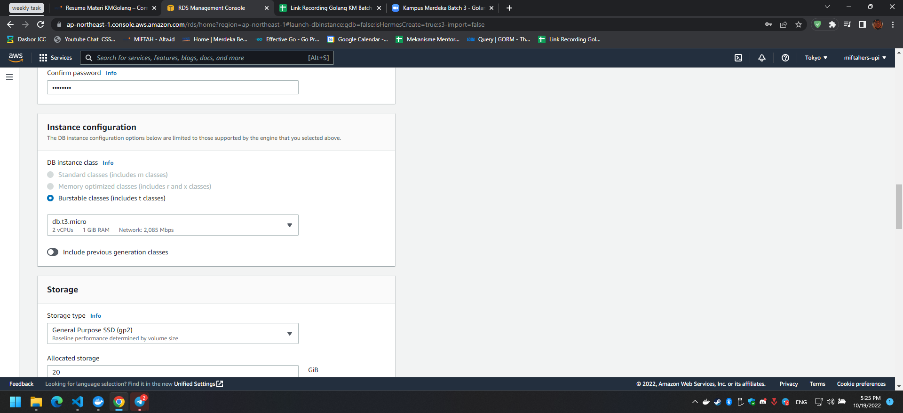
   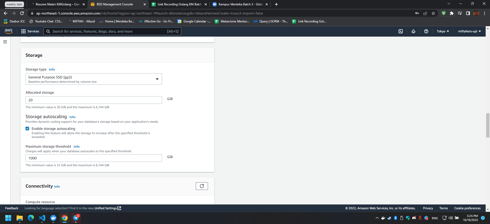
   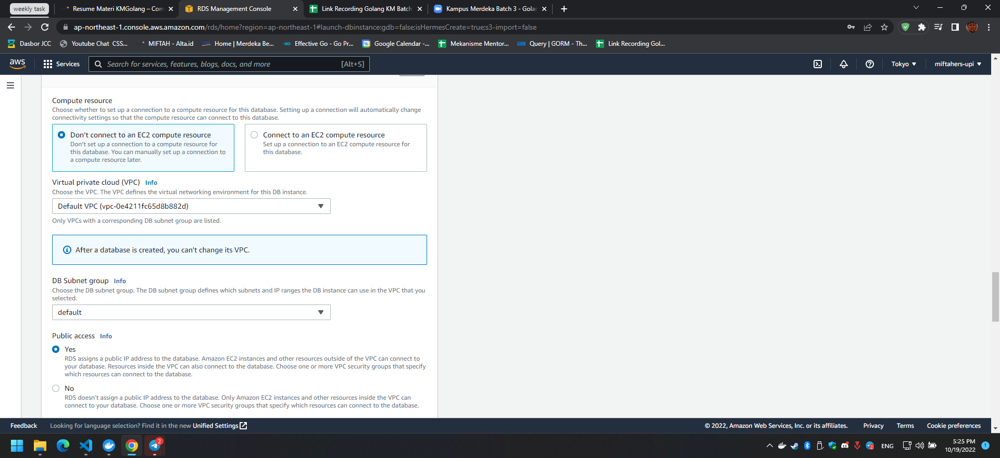
   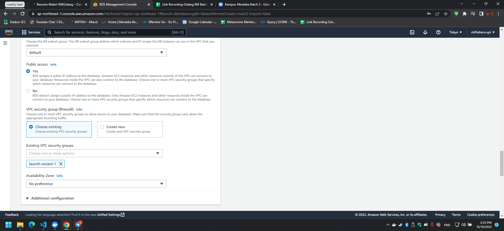
   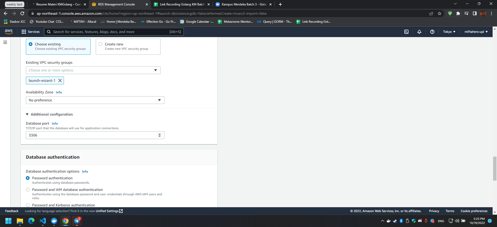
   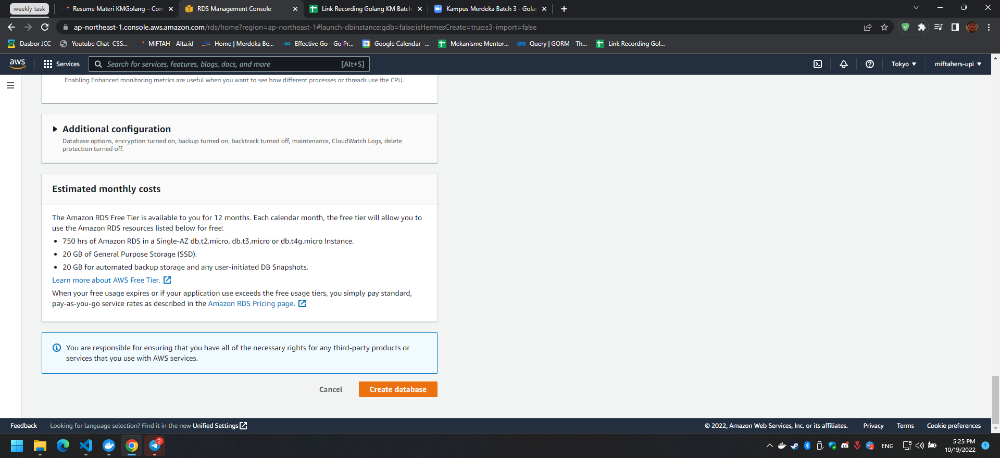
   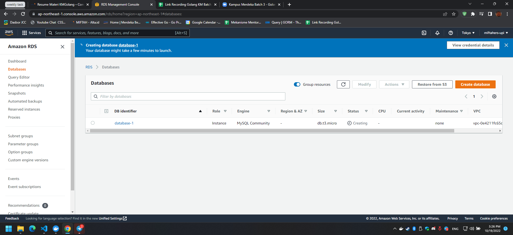
   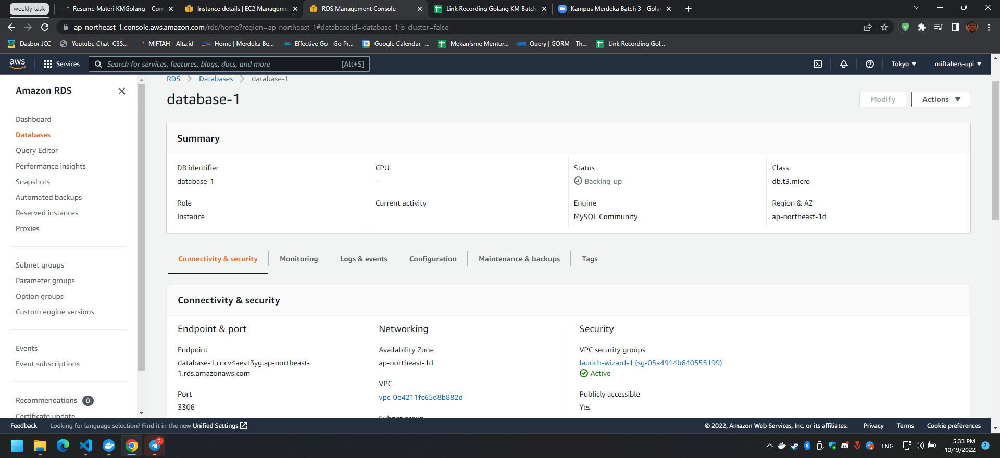

2. Migrate your local Data to RDS
   
   skip

3. Connect app to RDS

    - work using mysql in ec2 instance
    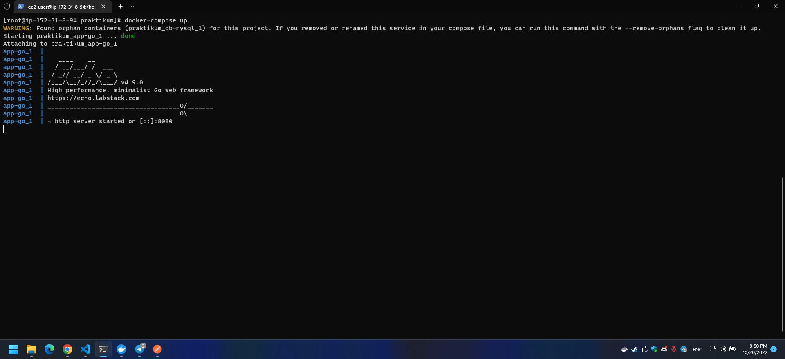
    - settingan docker-compose (bukti gak pake container mysql)
    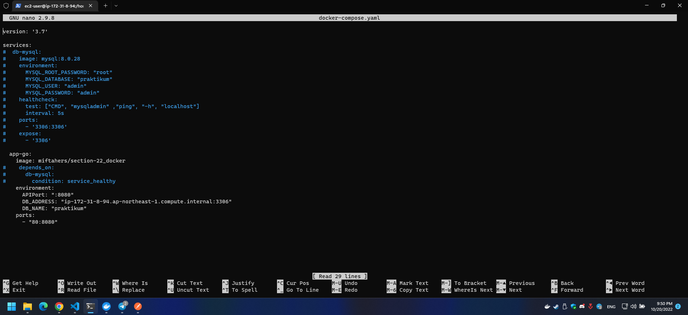
    - test postman
    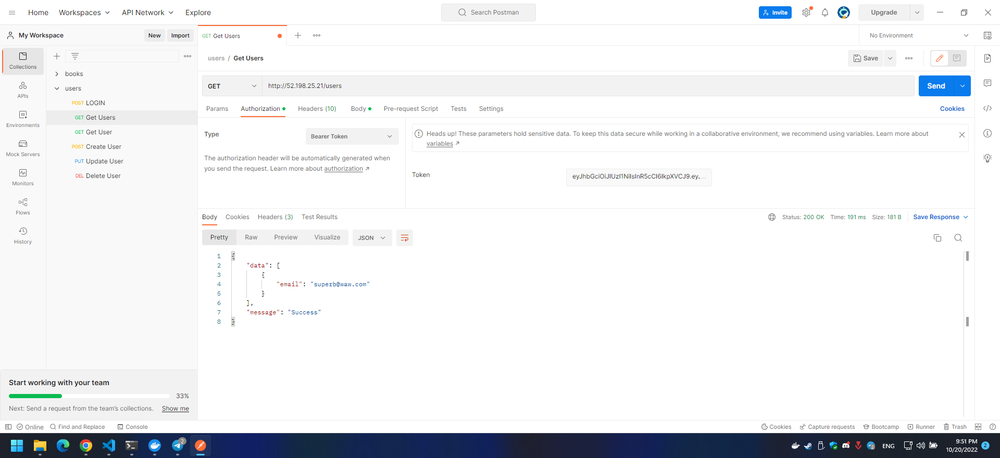
    - data exist in DB
    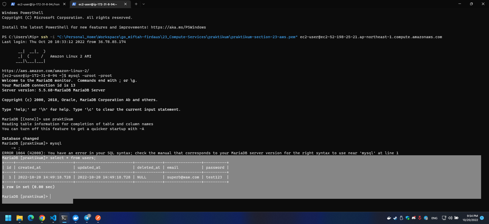