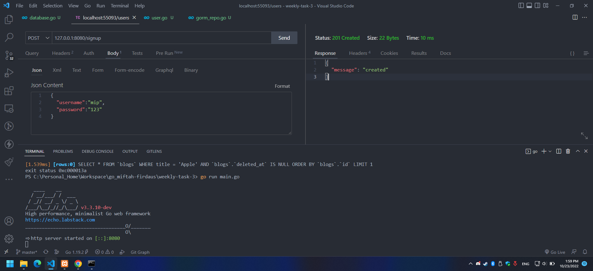

# Weekly task 3

1. Signup
   
2. Login
   
3. get all blog
   
4. get blog by id
   
5. new blog
   
6. update blog
   1. When executed
    
   2. After (Result)
    
7. delete blog
   1. When executed
   
   2. After (result)
   
8. Get by category id
   
9. get by title
    
10. create category
    
11. Implement jwt
    
12. unit testing
    